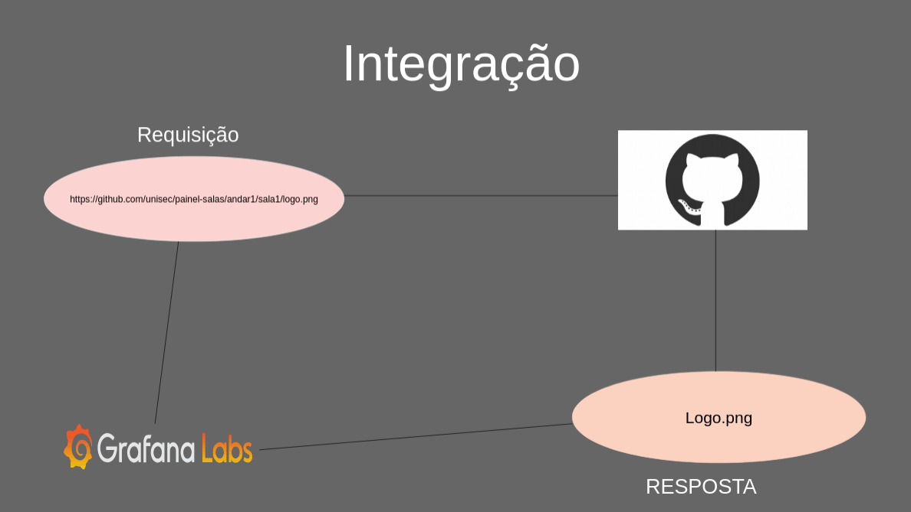

# GRAFANA 


 

# Painel de Salas

Solução criada com intuíto de ser uma ambiente onde estarão inseridas as `logos` das empresas alocadas no empreendimento `comercial`.


## Requisitos

* GRAFANA
* GITHUB
* HTML E CSS
* INTERNET

## INTEGRAÇÃO 



### Requisição

* GRAFANA -> http://github.com/unisec/painel-salas/cliente*/andar*/sala*/logo.png


### Resposta

* GITHUB -> logo.png


## Visualização 


## Como os usuário irão trocar ás imagens!!

`Passo 1` - Acessar o [GITHUB](https://github.com) com usuário e senha;
`Passo 2` - Irá até o " `/clientes/nomecliente*/andar*/sala*/` ", e realizar o upload da imagem com o nome de logo.png

`Obs:` Todas ás logos inseridas no github, precisam ter o formato .png


## Raiz de Diretórios

```
└─ clientes
    └─ nome-cliente
        └─ andar
            └─ sala
                └─ *.png 
├─ codigo
    └─ painel-salas.md
├─ images 
    └─ *.png
```
